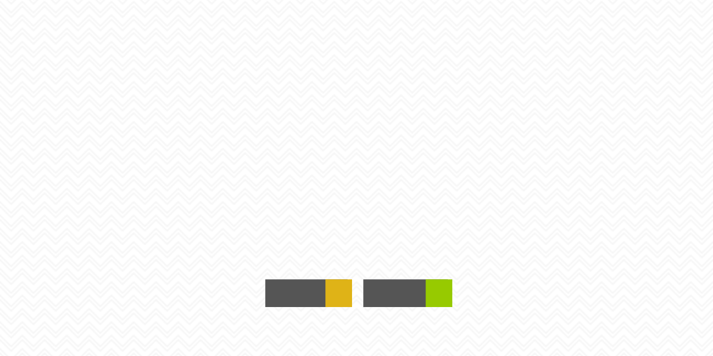

## 🎯 Objectif principal

Le but de ce projet est de créer un super assistant pour gérer mon organisation chaotique.
Dans un premier temps je monte une base documentaires avec Obsidian, en mode second cerveau. Puis une base d'activités via des données diverses et variées.
Dans un deuxième temps, implementer une IA générative pour analyser tout cela et gérer mon organisation et mon agenda.

## 🔹 Contexte & Motivation

J'ai de très gros problèmes d'organisation, le but est d'y remédier

---

### Objectif 01 - Création d'un base documentaires sous Obsidian.md

Le but ici est de créer une base de connaissances avec Obsidian.
Les différents articles insérés sont analysés, catégorisés, classés, retraités, reformulés et synthétisés par une IA locale Ollama.
 
---
### Objectif 02 - Collecter les données d'activités.md

Le but ici est de collecter mes données d'activités issues de différentes sources.
Mon activité informatique, android, les flux audios et vidéos via Listenbrainz, Youtube ou Trakt.tv.
Mes données physiologiques via Garmin connect.
Le but est d'intégrer tout cela dans une base de données MySQL afin de pouvoir les exploiter.
 

---
### Objectif 03 - Fiabiliser Listenbrainz.md

Listenbrainz est alimenté par des scrobblers, mais la plupart ne sont réellement que pour la musique.
Il s'agit donc de créer des règles pour intégrer correctement les vidéos et podcast.
 
---
### Objectif 04 - Process Android.md

Autant pour des pc classiques, il est plus ou moins facile de récupérer l'activé.
Sur un smartphone c'est un peu plus compliqué.
Certaines applications permettent d'extraire l'activité mais demandent une intervention manuelle, le but ici est d'automatiser au maximum.
 
---
### Objectif 05 - Zexploiter les données.md

Une fois les données récupérées il faut les mettre en musique.
Comment ? via des règles définis au préalable ?
via une IA ? si oui quel modèle ? locale ?

---
### Objectif 06 - Process Garmin.md

Garmin permet de récupérer plusieurs types de données, les activités sportives mais également les activités quotidiennes, pas, sommeil, calories, cardio etc...
 
---
## 🗺 Roadmap

### 🚀 Roadmap Brain_Ops.md

### **📌 MVP – Base Fonctionnelle (Obsidian & Données)**

🎯 Objectif : Construire une **base documentaire et une base d’activités structurée**

✅ **1. Structuration du Second Cerveau**

✅ **2. Base d’Activités & Données**

---

### **📌 V1 – Premiers outils d’analyse**

🎯 Objectif : Extraire des insights utiles depuis les données

✅ **1. Analyse basique des données**

✅ **2. Intégration avec des outils externes**

---

### **📌 V2 – IA Générative & Assistant Intelligent**

🎯 Objectif : Rendre l’assistant **proactif et intelligent**

✅ **1. Implémentation d’une IA générative**

✅ **2. Planification et gestion automatisée**

---

🛠 **👉 Prochaines actions immédiates (MVP)** :

1. Définir clairement la structure d’Obsidian
2. Choisir les types de données à collecter pour la base d’activités
3. Mettre en place un système simple pour automatiser la capture d’infos
---

## Authors

👤 **u2pitchjami**

* Twitter: [@u2pitchjami](https://twitter.com/u2pitchjami)
* Github: [@u2pitchjami](https://github.com/u2pitchjami)
* LinkedIn: [@LinkedIn](https://linkedin.com/in/thierry-beugnet-a7761672)
